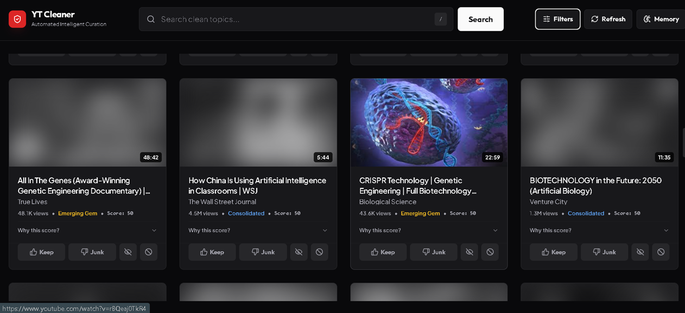

# YT Cleaner 🚀



YT Cleaner is a stateless, browser-native YouTube curation client that removes algorithmic clickbait, filters video durations to match your schedule, and automatically fast-forwards through embedded sponsor ads. It runs without databases, cloud dependencies, or developer API keys, saving your learned favorite tags and blacklist blocks 100% locally inside your browser's `localStorage`.

---

## ⚡ Key Curation Upgrades

YT Cleaner shifts the control of recommending and filtering content from YouTube's server-side dopamine algorithms directly to your browser:

*   **🎬 Auto-Skip Sponsor Player Modal:** Left-clicking a card opens a custom split-pane playback dashboard. It integrates the official YouTube Iframe Player API and fetches segment timestamps via the SponsorBlock database. If a video hits a sponsored block, the player fast-forwards past it automatically, showing a visual alert.
*   **🌫️ Grounded Mode (Visual Noise Filter):** A filter toggle that blurs all video thumbnails (`blur(20px)`) and converts them to grayscale. Hovering over a card clarifies the thumbnail. This forces you to select videos based on content titles and channels rather than high-saturation clickbait graphics.
*   **💎 Mainstream Blocker (Emerging Gems Slider):** An adjustable range slider in the memory sidebar that alters curation scoring. You can mathematically boost independent creators ($<50k$ views) or discount consolidated mainstream giants.
*   **⏱️ Time Budget Filters:** Fast tabs to isolate feeds by video length: **All Time**, **Quick (<5m)**, **Standard (5-25m)**, and **Deep (>30m)**.
*   **🚫 One-Click Channel Blacklisting:** A direct ban button (`🚫`) sweeps all cards of that creator off your screen with a smooth fade-out animation and blocks them permanently from future feed loads.
*   **🌍 Language stop-words Classifier:** Analyzes word distributions in titles to filter out English or Spanish videos on-the-fly, keeping mixed-language feeds clean.

---

## ⚙️ How Curation Works

1.  **Scraping:** The Python FastAPI backend acts as a lightweight, stateless scraper. It queries search seeds and liked channel subscriptions using flat metadata extraction, returning raw lists to the client.
2.  **Scoring & Interleaving:** The browser scoring engine personalizes video cards based on your local memory. Clicking **Keep** (+15 channel, +3 keywords) or **Junk** (-30 channel, -5 keywords) updates local parameters. Cards are interleaved (1 consolidated mainstream video, 1 emerging gem) to give independent creators equal weight.
3.  **Visual Controls:** Toggles for categories (General, Entertainment, Music, Education) and clickbait filters are accessible inside a collapsible filters panel, optimizing vertical space. On mobile viewports, all option selectors behave as swipeable, horizontal carousel tracks.

---

## 🚀 Quick Start

### Running Locally
```bash
# Install dependencies
pip install -r requirements.txt

# Run the FastAPI server
python -m uvicorn main:app --reload
```
Open [http://localhost:8000](http://localhost:8000) inside your web browser.

### Running with Docker
```bash
# Build the Docker image
docker build -t yt-cleaner .

# Run the container
docker run -d -p 8000:8000 yt-cleaner
```
